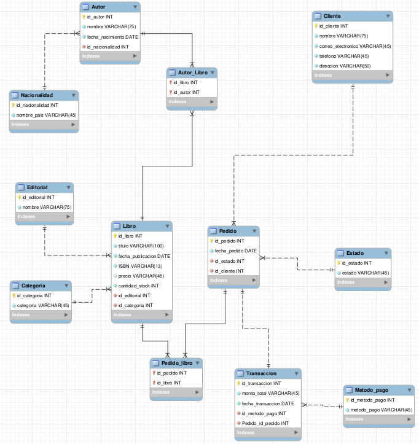

# 📚 Base de Datos — Librería El Mundo

Base de datos relacional (MySQL) diseñada para gestionar las operaciones de una librería: catálogo de libros, autores, editoriales, clientes, pedidos y transacciones de pago.

---

## 🗂️ ¿Para qué sirve esta base de datos?

Esta base de datos modela el flujo completo de una librería, permitiendo:

- Llevar un **catálogo de libros** con su autor, editorial, categoría, ISBN, precio y stock disponible.
- Registrar **autores** junto con su nacionalidad y fecha de nacimiento.
- Gestionar **clientes** y sus datos de contacto.
- Controlar el ciclo de vida de un **pedido**, desde que se crea hasta que se entrega (mediante estados como *Pendiente*, *Confirmado*, *En preparación*, *Enviado*, *Entregado*).
- Registrar las **transacciones de pago** asociadas a cada pedido y su método de pago.

En resumen: es el motor de datos detrás de una tienda de libros, cubriendo tanto el inventario como el proceso de venta.

---

## 🧩 Estructura general

El modelo está compuesto por **13 tablas**, organizadas en 4 bloques:

| Bloque | Tablas | Propósito |
|---|---|---|
| **Autores** | `Nacionalidad`, `Autor` | Información de los autores y su país de origen |
| **Catálogo** | `Editorial`, `Categoria`, `Libro`, `Autor_Libro` | Libros disponibles, su editorial, categoría y autor(es) |
| **Clientes y pedidos** | `Cliente`, `Estado`, `Pedido`, `Pedido_libro` | Clientes y el seguimiento de sus pedidos |
| **Pagos** | `Metodo_pago`, `Transaccion` | Registro de pagos realizados por pedido |

Las tablas `Autor_Libro` y `Pedido_libro` son **tablas intermedias**, ya que existen relaciones muchos-a-muchos: un libro puede tener varios autores (o un autor varios libros), y un pedido puede incluir varios libros.

**Imagen de la estructura**



📌 El diagrama Entidad-Relación completo se encuentra en `assets/img/Diagrama_ER_UML.png`.

---

## 📝 Notas 

### 1. ISBN limitado a 13 caracteres

El campo `ISBN` en la tabla `Libro` se definió como `VARCHAR(13)`, ya que ese es el estándar internacional vigente para la identificación de libros. Esto respalda la decisión:


**Ver página oficial:** [¿Qué es un ISBN? ](https://www.isbn-international.org/es/content/que-es-un-isbn/10#:~:text=ISBN%3F-,Un,c%C3%B3digo,-%2E)

Es decir, desde 2007 todo ISBN asignado tiene 13 dígitos, por lo que restringir el campo a esa longitud garantiza que los datos ingresados cumplan con el estándar internacional actual.

### 2. Nombres de editoriales con mayor longitud

El campo `nombre` de la tabla `Editorial` se definió como `VARCHAR(75)` en lugar de un tamaño más corto, para tener libertad de registrar nombres de editoriales largos sin riesgo de truncamiento.

### 3. Tablas intermedias con llave primaria compuesta

Para resolver las relaciones muchos-a-muchos (autor–libro y pedido–libro), se crean tablas intermedias cuya llave primaria está compuesta por las dos llaves foráneas que participan en la relación:

```sql
PRIMARY KEY (llave1, llave2)
```

Después de declarar la llave primaria compuesta, se agregan las referencias (`FOREIGN KEY`) que conectan cada columna con su tabla de origen. Esto asegura que no se puedan repetir combinaciones duplicadas (por ejemplo, el mismo libro asociado dos veces al mismo autor) y que la integridad referencial se mantenga en ambos sentidos.

Ejemplo real aplicado en `Autor_Libro`:

```sql
CREATE TABLE IF NOT EXISTS Autor_Libro(
    id_libro INT NOT NULL,
    id_autor INT NOT NULL,
    PRIMARY KEY (id_libro, id_autor),
    FOREIGN KEY (id_libro) REFERENCES Libro(id_libro),
    FOREIGN KEY (id_autor) REFERENCES Autor(id_autor)
);
```

El mismo patrón se repite en `Pedido_libro` para relacionar pedidos con libros.

### 4. Archivos `.mwb` para visualizar los diagramas
 
En la ruta [`database/diagramas`](./database/diagramas/) se incluyen dos archivos de **MySQL Workbench** (`.mwb`) que permiten explorar el modelo de forma visual e interactiva:
 
- [`Diagrama ER UML.mwb`](./database/diagramas/Diagrama%20ER%20UML.mwb) — Es el modelo entidad-relación **diseñado antes de escribir el SQL**, usado como guía inicial para estructurar las tablas y sus relaciones.
- [`Reverse_Engineer_Resultado.mwb`](./database/diagramas/Reverse_Engineer_Resultado.mwb) — Es el diagrama generado **a partir del `DDL.sql` ya ejecutado**, usando la función *Reverse Engineer* de Workbench. Sirve para confirmar que la base de datos creada coincide con el diseño original.
Para abrirlos necesitas tener **MySQL Workbench** instalado; solo debes descargar el archivo y abrirlo directamente desde la aplicación (`File > Open Model`). Ahí podrás hacer zoom, mover las tablas y ver las relaciones con más detalle que en una imagen fija.

---

## 📁 Estructura del proyecto

```
BaseDatos_Libreria_El_mundo/
├── database/
│   ├── DDL.sql                # Creación de la base de datos y sus tablas
│   ├── DML.sql                # Datos de ejemplo (INSERTs)
│   ├── DQL.sql                # Consultas de ejemplo (SELECTs)
│   └── diagramas/              # Archivos .mwb de MySQL Workbench
├── assets/
│   ├── img/                   # Diagramas ER exportados como imagen
│   └── docs/                  # Documentación adicional en PDF
└── README.md
```
---

## ⚙️ Cómo usar la base de datos
 
### 📋 Requerimientos
 
- Tener **MySQL Server** instalado (o un gestor equivalente compatible, como MariaDB).
- Tener **MySQL Workbench** instalado para poder ejecutar los scripts de forma visual (también se puede usar la terminal o cualquier otro cliente de MySQL de tu preferencia).
### 👣 Pasos
 
1. Abre **MySQL Workbench** y conéctate a tu servidor local (o al servidor donde quieras montar la base de datos).

2. Abre una nueva pestaña de consulta (*New SQL Tab*).

3. Copia y pega el contenido de [database/DDL.sql](./database/DDL.sql)y ejecútalo. Esto crea la base de datos `Libreria_El_mundo` y todas sus tablas.

4. Copia y pega el contenido de [database/DML.sql](./database/DML.sql) y ejecútalo. Esto inserta los datos de ejemplo dentro de las tablas ya creadas.

5. Copia y pega el contenido de [database/DQL.sql](./database/DQL.sql) y ejecútalo para probar las consultas incluidas.
    
    > ⚠️ **Nota:** El orden importa: primero `DDL.sql` (estructura), luego `DML.sql` (datos), y finalmente `DQL.sql` (consultas). Si ejecutas `DML.sql` o `DQL.sql` antes de crear las tablas, obtendrás un error.
 
### 📦 Datos de ejemplo
 
El archivo `DML.sql` **no es obligatorio**, pero se incluye para que el usuario pueda cargar datos de prueba (nacionalidades, autores, editoriales, libros, clientes, pedidos, etc.) y así ver el funcionamiento real de la base de datos sin necesidad de escribir sus propios registros. Se recomienda ejecutarlo justo después del `DDL.sql` para poder probar las consultas del siguiente apartado.
 
### 🔍 Consultas de ejemplo
 
El archivo `DQL.sql` no solo sirve para probar la base de datos: también incluye **consultas rápidas para visualizar las tablas** ya cargadas con datos, por ejemplo:
 
- Consultar todos los libros registrados.
- Consultar los libros con fecha de publicación anterior a 1950.
Estas consultas son un buen punto de partida para explorar la información y pueden usarse como base para crear consultas propias más específicas.
 
---
 
## 🔗 Relaciones clave del modelo
 
| Entidad A | Relación | Entidad B | Tipo |
|---|---|---|---|
| `Libro` | pertenece a | `Editorial` | 1 a muchos |
| `Libro` | pertenece a | `Categoria` | 1 a muchos |
| `Libro` | se relaciona con | `Autor` (mediante `Autor_Libro`) | Muchos a muchos |
| `Cliente` | genera | `Pedido` | 1 a muchos |
| `Pedido` | tiene | `Estado` | 1 a muchos |
| `Pedido` | se relaciona con | `Libro` (mediante `Pedido_libro`) | Muchos a muchos |
| `Pedido` | genera | `Transaccion` | 1 a 1 |
| `Transaccion` | usa | `Metodo_pago` | 1 a muchos |

---

## 👨 AUTOR
Programador Full-Stack Jr. Alan Gomez

GitHub: [AlanGomez-Programmer](https://github.com/AlanGomez-Programmer)

Linkedln: alan-gomez-763163320
